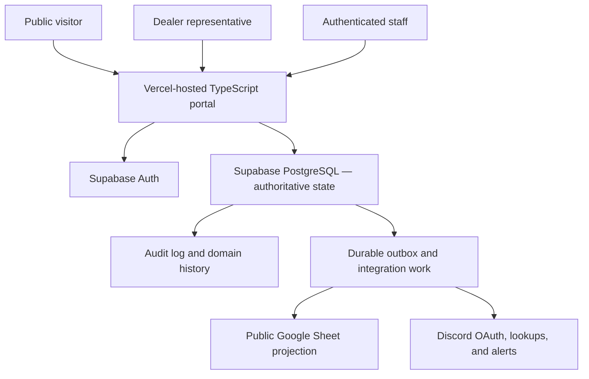
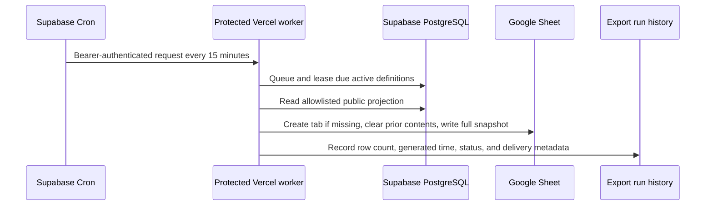

# East Empire Company Trade Registry — Complete User Guide

Status: Production operator guide  
Production portal: <https://eec-trade-registry-portal.vercel.app>  
Public registry Sheet: <https://docs.google.com/spreadsheets/d/13bJeSAUF52cQnudC_l0JNOlKmcYY0wRWIq8OVqiEdrc/edit>  
Institutional time zone: `America/New_York`  
Configured currency: `SEP` (Septims, zero decimal places)

## 1. Purpose of this guide

This guide explains how to use the implemented East Empire Company trade registry as a public visitor, dealer representative, staff operator, or platform administrator. It also explains what each operation changes, what it deliberately does not change, how the public Google Sheet is connected, and how to diagnose routine problems.

## Fastest routine administration

Open `/staff/configuration` and use **Quick operations** for the two most common setup tasks.

To add a normal item, enter its name, category, unit, and supply workflow, then select **Create complete item**. The system can generate the item code, public URL slug, audit wording, and receipt reference. Open the optional section only when you need a starting price, opening quantity, reserve thresholds, or custom public wording. The item and supply policy are always created together; selected publication, price, and permitted opening stock either all commit or all roll back.

To add ordinary stock, search for an item, enter the quantity, select its location, and choose **Add to inventory**. Source and audit text are optional because the portal can generate traceable defaults. This still creates a balanced immutable ledger transaction. It does not overwrite a stock cell.

Player-sourced reserves such as configured keystone materials intentionally do not appear in the quick-receipt list. Receive those on the Economy desk against a registered supplier and current purchase offer. Serialized items use the Serialized assets desk. Those additional steps are evidence, not avoidable form friction.

The same Configuration studio can add categories, units, license types, endorsements, availability wording, and control profiles without a code deployment. Public presentation and price can be replaced from each item card; previous effective versions remain in history.

For a plain-language, roleplay-first explanation built around a public customer, licensed business, EEC agent, and warehouse handoff, start with the [Player and Discord Admin Handbook](PLAYER_ADMIN_HANDBOOK.md).

The governing rule for every workflow is:

> Supabase PostgreSQL is the only authoritative source of business data.

The portal reads and changes Supabase records through approved projections and secure commands. Google Sheets, Discord messages, exports, and future generated documents are outputs of those records. They are never substitute databases.

### Guide navigation

- Sections 2–4: architecture, core concepts, login, and roles
- Sections 5–6: public catalogue and verification
- Sections 7–9: catalogue, dealer, and licensing administration
- Sections 10–18: orders, inventory, reservations, fulfillment, transfers, consignment, assets, and compliance
- Sections 19–22: access administration, operations, Google Sheets, and Discord
- Sections 23–27: daily routine, examples, troubleshooting, safety, and implementation boundaries
- Section 28: governing product and engineering documents

## 2. System at a glance



The portal has three audiences:

| Audience | Authentication | Main capabilities |
|---|---|---|
| Public | None | Browse the catalogue and verify exact dealer or license references |
| Dealer representative | Supabase dealer credentials plus an active representative grant | View represented organizations, submit and inspect orders, cancel eligible orders, and report consignment observations |
| Staff | Discord OAuth plus active database role assignments | Operate the desks allowed by the assigned roles and scopes |

Authentication and authority are separate. A successful login identifies an actor. It does not grant business permission by itself.

## 3. Core concepts every operator must understand

### 3.1 One authoritative database

If information differs between the portal, Sheet, Discord, or a copied document, Supabase is authoritative. Operators should investigate the source record and integration history rather than editing an output to make it look correct.

### 3.2 Secure commands, not direct edits

Consequential actions run through database or secure server functions. These functions re-read current state, confirm the actor's permission and scope, validate the transition, write history and audit evidence, and create integration work in one transaction.

The browser does not authoritatively calculate:

- Inventory balances
- Available stock
- Reservation capacity
- Order approval authority
- Price overrides
- License or endorsement eligibility
- Custody transfers
- Compliance effects

### 3.3 Effective dates

Dealer authority, licenses, endorsements, staff assignments, publications, and similar records may have start and end times. A record can exist while no longer conferring current authority.

### 3.4 Versioned records

Many staff forms carry an expected record version. If another operator changes the record before the first operator submits, the stale submission is rejected instead of overwriting newer work. Refresh the record, review the new state, and submit a new decision.

### 3.5 Idempotency

Retryable commands use request identifiers or unique constraints so a network retry does not duplicate an order, stock movement, fulfillment, transfer, notification, or export.

### 3.6 Append-only evidence

Posted inventory movements, domain events, and audits are not rewritten. Corrections use an explicit reversal, corrective transaction, superseding version, reopening, or later status event.

## 4. Access and roles

### 4.1 Staff sign-in

1. Open <https://eec-trade-registry-portal.vercel.app/staff/login>.
2. Select **Continue with Discord**.
3. Approve the Discord OAuth request when prompted.
4. Supabase exchanges the one-time authorization code and creates the portal session.
5. The portal resolves the matching actor and active staff assignments.

Discord server roles, display names, and bot permissions do not grant EEC business authority. Staff authority comes from effective-dated database assignments.

If Discord sign-in succeeds but a staff desk is denied, the usual cause is a missing, expired, revoked, or out-of-scope database assignment.

### 4.2 Dealer sign-in

Dealer access begins at <https://eec-trade-registry-portal.vercel.app/dealer/login>.

A dealer session must satisfy all of the following:

- Valid Supabase Auth session
- Actor profile linked to that authenticated user
- Active representative relationship to the organization
- Required representative scope, such as `portal.read` or `order.create`
- Current authority-conferring dealer authorization

Dealer access is organization-scoped. An inaccessible order or party uses safe not-found behavior rather than revealing that another dealer's record exists.

### 4.3 Implemented staff role bundles

Roles are composable. One person may hold several roles.

| Role | Primary purpose |
|---|---|
| Platform administrator | Manage effective-dated staff assignments and inspect operational health |
| Catalogue manager | Read and maintain canonical catalogue records |
| Dealer registry officer | Onboard dealers and manage authorization lifecycle |
| Licensing officer | Issue licenses, change license status, and manage endorsements |
| Order officer | Review, approve, price, await stock, deny, or cancel orders |
| Warehouse operator | Receive stock, manage routine reservations and fulfillment, and perform scoped transfer work |
| Inventory controller | Includes elevated reversals, transfer authorization, asset lifecycle, and broader custody controls |
| Compliance officer | Manage cases, inspections, evidence metadata, findings, record-only actions, and appeals |
| Integration operator | Configure non-secret destinations, schedules, manual exports, and delivery replay |
| Auditor | Read approved private history without mutation authority |

Platform administration does not automatically grant licensing, order, warehouse, compliance, or integration powers. Domain roles remain separate so an administrator cannot perform unrelated business actions merely because they manage access.

## 5. Public catalogue

Open <https://eec-trade-registry-portal.vercel.app/>.

The public catalogue can show:

- Item code and public name
- Public description
- Category, unit, and tags
- Configured control label
- Coarse availability wording
- Public price when configured
- Currency
- Minimum order and increment
- Plain-language requirements
- Publication and generation metadata

Catalogue publication is separate from stock and eligibility. A visible item may be awaiting stock, require a license, require staff review, or have no current price.

The public interface does not expose exact warehouse stock, private price schedules, acquisition cost, internal notes, unpublished controls, or serialized-asset custody.

### Public price interpretation

- A displayed price is a public projection, not a final order settlement.
- A blank price means pending or unavailable, never zero.
- Submitted order lines preserve a price snapshot when a price exists.
- Staff may set or change an order price only with the required permission and reason.

## 6. Public verification

Open <https://eec-trade-registry-portal.vercel.app/verify>.

### 6.1 Verify a dealer

1. Select **Dealer authorization**.
2. Enter the exact public dealer reference.
3. Submit the lookup.

An approved response may show the public name, dealer type, jurisdiction, public premises, authorization status, effective dates, related public licenses, and public notice.

### 6.2 Verify a license

1. Select **License**.
2. Enter the exact public license reference.
3. Submit the lookup.

An approved response may show the holder, class, jurisdiction, status, effective dates, endorsements, public conditions, and public notice.

### 6.3 Privacy behavior

Unknown, malformed, private, unpublished, and otherwise non-verifiable records share the same general miss contract. The public lookup does not disclose private contacts, applications, internal standing, staff notes, allegations, investigations, orders, or credentials.

The demonstration references currently visible in the seeded environment are:

- Dealer: `DLR-DEMO-A7K9`
- License: `LIC-DEMO-4Q2M`

They are fictional demonstration records and should be replaced or supplemented with approved operational data before a public launch announcement.

## 7. Staff catalogue desk

Open <https://eec-trade-registry-portal.vercel.app/staff>.

### 7.1 Create an item

1. Open the new-item form.
2. Enter a stable item code.
3. Enter the internal and public presentation fields supported by the form.
4. Select configured category, unit, inventory mode, and control metadata.
5. Supply the audit reason where required.
6. Submit the command.

Creation makes one canonical item. It does not automatically create stock, a reservation, a license rule, or a dealer-specific copy.

### 7.2 Edit an item

1. Open the item detail/edit page.
2. Review the current version and status.
3. Change permitted metadata.
4. Explain the reason.
5. Submit.

A stale version is rejected. Item code and public slug remain stable under the current correction policy boundary.

### 7.3 Archive or restore

Archiving removes the item from current public use without deleting its history. Restoring is a separate reasoned command. Neither operation changes historical orders, ledger movements, or audits.

## 8. Dealer registry desk

Open <https://eec-trade-registry-portal.vercel.app/staff/dealers>.

The queue lists dealer records, current status, type, jurisdiction, public/private visibility, premises, and latest update.

### 8.1 Onboard a dealer

1. Select **Onboard dealer**.
2. Choose the party type. **Organization** is the production default.
3. Enter legal name, internal display name, and optional public display name.
4. Select a configured dealer type and jurisdiction.
5. Choose the initial authorization status.
6. Enter public premises and public notice information when appropriate.
7. Put restricted operational commentary in private notes, not public notes.
8. Enable public disclosure only when the record is ready for public verification and export.
9. Enter the audit reason.
10. Submit.

The party and initial dealer authorization are created atomically. A failure creates neither record.

### 8.2 Maintain a dealer

Open **Review dealer** from the queue. Depending on current state and permission, staff can:

- Update public and private detail
- Activate the authorization
- Suspend it
- Reinstate it
- Revoke it
- Change public-disclosure status

Every lifecycle command requires an allowed source state, a current version where applicable, an authorized actor, and a reason. The previous record remains reconstructable through events and audit history.

Dealer authorization and licensing are separate. A dealer may require both a current dealer authorization and an appropriate license for a particular transaction.

## 9. Licensing office

Open <https://eec-trade-registry-portal.vercel.app/staff/licensing>.

### 9.1 Issue a license

1. Open the new-license form.
2. Select the existing holder party.
3. Select the configured license class and jurisdiction.
4. Choose the initial permitted status.
5. Set the effective date.
6. Leave expiration blank when no approved duration policy applies.
7. Select initial endorsements where appropriate.
8. Enter public notes separately from private notes.
9. Enable public verification only when approved.
10. Enter a reason and submit.

The database allocates the immutable public reference and creates the license, initial status history, selected endorsements, audit evidence, and outbox event in one transaction.

### 9.2 Manage license status

The implemented lifecycle supports reasoned, permission-checked operations including:

- Activate
- Suspend
- Reinstate
- Revoke
- Record surrender

Revoked and surrendered states are terminal in the current model. Expiration behavior and grace periods remain policy-gated.

### 9.3 Manage endorsements

Endorsements are modular grants attached to a license. Granting or revoking one creates effective-dated history; it does not rewrite the license class or erase prior authority.

Applications, renewal review, automatic expiration, and condition-authoring workflows are not yet active. Staff must not represent direct issuance as an application decision when no application record exists.

## 10. Dealer orders

Dealer representatives use:

- <https://eec-trade-registry-portal.vercel.app/dealer/orders>
- <https://eec-trade-registry-portal.vercel.app/dealer/orders/new>

### 10.1 Submit a requisition

1. Sign in as an authorized representative.
2. Select the represented organization when more than one is available.
3. Start a new order.
4. Add item and quantity lines.
5. Select the supported fulfillment mode and provide required context.
6. Submit.

Submission validates the representative grant, current dealer authorization, optional license, published items, positive quantities, and configured control snapshots. It creates an `EEC-ORD` reference, order and line history, audit evidence, and an outbox event.

Submission deliberately does not:

- Reserve stock
- Move inventory
- Transfer title or custody
- Consume quota
- Promise a settled price

Orders may be submitted without stock on hand. Such demand can proceed to an awaiting-stock decision.

### 10.2 Dealer cancellation

A dealer with `order.cancel` scope may cancel an eligible order before reservation, ready, or fulfillment progress prevents cancellation. Fulfilled quantities are never retroactively cancelled.

## 11. Staff order desk

Open <https://eec-trade-registry-portal.vercel.app/staff/orders>.

### 11.1 Review an order

1. Open an order from the queue.
2. Review the dealer, authorization, optional license, fulfillment request, item control snapshots, requested quantities, price state, and order history.
3. Choose the supported decision for each line:
   - Full approval
   - Partial approval
   - Awaiting stock
   - Denial
4. Set an authorized price when appropriate, or leave it explicitly pending.
5. Enter the decision reason.
6. Submit.

The command selects the required ordinary, restricted, or unique approval permission from the stored line control snapshot. The database derives the resulting line and header states; the browser does not.

### 11.2 Important order rules

- Approval does not reduce warehouse stock.
- Awaiting stock preserves commercial demand.
- Partial approval is supported.
- Cancellation or denial cannot erase fulfilled history.
- A price override is a distinct authorized action, not a hidden browser calculation.
- Reservation and fulfillment remain separate warehouse steps.

## 12. Inventory desk

Open <https://eec-trade-registry-portal.vercel.app/staff/inventory>.

### 12.1 Understand the displayed quantities

For fungible stock:

```text
Posted physical on hand
- effective active reservations
= available quantity
```

No operator directly edits a `current stock` field. The displayed position is derived from immutable ledger entries and current reservation records.

### 12.2 Receive stock

1. Select the warehouse and stock location permitted by the assignment scope.
2. Select a fungible item.
3. Enter the received quantity and source context.
4. Enter a reason and request identifier when required.
5. Post the receipt.

The command posts a balanced transaction from an external source account into the physical warehouse account. Negative physical balances are forbidden.

### 12.3 Correct a posted receipt

Do not edit or delete it. An inventory controller posts one linked reversal with a reason. If needed, post a separate corrected receipt afterward.

A reversal is rejected if it would make physical stock negative or reduce stock below effective reservations.

## 13. Reservations

Reservations are explicit time-bounded claims against approved order demand.

### 13.1 Create a reservation

1. Open the approved or awaiting-stock demand from the warehouse workflow.
2. Select the permitted warehouse stock account.
3. Enter a quantity that does not exceed remaining approved demand or available stock.
4. Create the reservation.

The default initial term is 48 hours. The database locks or otherwise serializes the relevant stock scope so two operators cannot claim the same final units.

### 13.2 Extend or release

Authorized staff may extend or release an active reservation with a reason. Expired reservations no longer reduce available stock. A consumed reservation remains historical and is never reactivated by a fulfillment reversal.

## 14. Fulfillment desk

Open <https://eec-trade-registry-portal.vercel.app/staff/fulfillment>.

### 14.1 Fulfill reserved stock

1. Locate an active, unexpired reservation.
2. Confirm the order line, warehouse, item, quantity, and collecting or receiving context.
3. Enter the reason or confirmation required by the form.
4. Complete fulfillment.

One transaction:

- Locks the relevant order, line, reservation, and physical account
- Marks the reservation consumed
- Posts the balanced physical-to-external inventory issue
- Increases fulfilled quantity
- Derives line and order status
- Writes audit and history
- Emits `fulfillment.completed`

### 14.2 Reverse a fulfillment

An inventory controller may post a linked reversal. This restores ledger stock and reopens outstanding demand while preserving the original fulfillment and consumed reservation as historical evidence.

## 15. Warehouse transfers

Open <https://eec-trade-registry-portal.vercel.app/staff/transfers>.

The implemented fungible transfer path uses:

```text
requested -> authorized -> dispatched -> received
                 |              |
                 |              +-> disputed
                 +-> cancelled before dispatch
```

### 15.1 Request

A warehouse operator selects source and destination warehouses, item, and full transfer quantity. The request creates no hidden destination stock.

### 15.2 Authorize

An inventory controller revalidates scope, stock, and current transfer version before authorization.

### 15.3 Dispatch

Dispatch posts stock from the source physical account into an explicit in-transit custody account.

### 15.4 Receive

Receipt posts the in-transit quantity into the destination physical account. A discrepancy remains explicitly in transit or disputed; it is not fabricated as received.

A dispatched transfer cannot be cancelled. Use the supported receipt, dispute, return, or later resolution workflow.

## 16. Consignment desk

Staff use <https://eec-trade-registry-portal.vercel.app/staff/consignments>. Dealer representatives use <https://eec-trade-registry-portal.vercel.app/dealer/consignments>.

Consignment separates ownership from custody:

```text
Owner: East Empire Company
Custodian: Authorized dealer
Stock state: Consigned
```

### 16.1 Create and maintain an agreement

Authorized staff can create an effective-dated agreement between the configured owner and a currently authorized dealer, then suspend, reactivate, or close it. Closing is blocked while ledger-backed custody remains outstanding.

Free-text terms are descriptive only. They do not implement commissions, settlement calculations, or liability rules.

### 16.2 Issue fungible stock

1. Select the active agreement.
2. Select an eligible item and available warehouse source account.
3. Enter the quantity and reason.
4. Post the issue.

The ledger moves custody from EEC physical stock to the dealer's consigned account while retaining the configured owner.

### 16.3 Dealer report

The representative reports sold, returned, lost, damaged, and observed-on-hand quantities. This is a claim and does not change inventory when submitted.

### 16.4 Staff acceptance

Ordinary acceptance requires exact reconciliation:

```text
prior outstanding custody
- reported sold
- reported returned
= observed on hand
```

Accepted sales move custody to an external account. Accepted returns move custody to a matching authorized warehouse account. Loss or damage cannot be accepted through the ordinary path because exception, liability, and settlement policy is unresolved.

## 17. Serialized assets

Open <https://eec-trade-registry-portal.vercel.app/staff/assets>.

Serialized items use individual `EEC-AST` asset identities and append-only events instead of fungible quantities.

Implemented staff operations include:

- Register an asset
- Allocate one asset to one approved unique order line
- Release or expire an allocation
- Transfer accepted custody
- Record an inspection
- Record condition or lifecycle events
- Mark missing and later recovered
- Record damage or seizure
- Retire or destroy under the permitted lifecycle

Ownership, custodian, warehouse, and location are separately represented. One asset cannot have two active allocations or two current accepted custodians.

Allocation does not move custody and is not fulfillment. Unique-asset fulfillment remains gated by transaction-specific approval and title-transfer policy.

## 18. Compliance desk

Open <https://eec-trade-registry-portal.vercel.app/staff/compliance>.

### 18.1 Open a case

1. Choose the configured case type and confidentiality.
2. Add the appropriate subject party and optional supported record link.
3. Write a neutral case summary.
4. Assign the case when appropriate.
5. Submit with a reason.

Opening a case is not a finding of wrongdoing.

### 18.2 Inspections, allegations, evidence, and findings

- Inspections record planned or completed evidence-gathering work.
- Allegations are separate immutable assertions.
- Evidence metadata records classification and reference; it does not expose a file or credential.
- Findings explicitly record `substantiated`, `not_substantiated`, or `inconclusive`.

### 18.3 Actions and appeals

The current action model is record-only. Staff can recommend, approve, decline, or void a configured action record, but `effect_applied` remains false. Recording a recommended suspension does not silently suspend a license, dealer, order, reservation, asset, or stock position.

An approved record-only action may receive one appeal. Staff can record an affirmed, varied, remanded, reversed, or withdrawn disposition. The appeal does not automatically stay or change another domain.

## 19. Access administration and operations

Open <https://eec-trade-registry-portal.vercel.app/staff/operations>.

### 19.1 Grant a role

1. Confirm the target actor identity. Never use a Discord display name as the identity key.
2. Select the role.
3. Set effective dates and supported assignment scope.
4. Enter a reason.
5. Grant the assignment.

### 19.2 Revoke a role

Revoke the exact active assignment with a reason. Revocation is effective-dated and audited. The database prevents revocation of the final active platform-administrator assignment.

### 19.3 Health review

The operations console summarizes conditions such as:

- Failed or pending outbox work
- Failed exports and deliveries
- Expired worker leases
- Overdue definitions
- Expired reservations
- In-transit or disputed transfers
- Open compliance work
- Active staff assignments

The console identifies conditions; it does not silently rewrite authoritative records.

## 20. Integration console

Open <https://eec-trade-registry-portal.vercel.app/staff/integrations>.

An integration operator can:

- Inspect runtime readiness without seeing secret values
- Configure non-secret spreadsheet or Discord channel identifiers
- Activate or deactivate approved destinations
- Activate or deactivate approved export schedules
- Queue a manual public snapshot
- Inspect recent export and delivery attempts
- Replay eligible failed deliveries with an audit reason

An integration operator cannot query arbitrary tables, edit the export query from the browser, read service-account credentials, or change source business records.

## 21. Is the Google Sheet linked to the platform?

Yes. The production Sheet is actively linked as a one-way scheduled projection:

<https://docs.google.com/spreadsheets/d/13bJeSAUF52cQnudC_l0JNOlKmcYY0wRWIq8OVqiEdrc/edit>

It contains the managed tabs:

- `Catalogue`
- `Dealers`
- `Licenses`

The production connection was independently confirmed on 2026-08-10. The anonymous CSV endpoints returned HTTP 200, and all three tabs contained a new 07:30 UTC generation watermark.

### 21.1 Exact data flow



The worker currently refreshes every 15 minutes. Each run queries approved public projection functions, replaces the managed tab with raw values, and records the result.

### 21.2 Direction of authority

```text
Supabase -> Google Sheet
Google Sheet -X-> Supabase
```

The Sheet is not two-way. Manual cell edits are not imported and will normally be overwritten by a later full-tab replacement. Do not use the Sheet to approve, correct, or administer anything.

### 21.3 What makes the connection secure

- The database scheduler calls a protected worker route.
- The route uses a server-only bearer secret.
- Google service-account credentials remain in Vercel's managed server environment.
- Only the spreadsheet identifier is stored as ordinary destination configuration.
- The service account can write the approved spreadsheet, but the browser never receives its private key.
- The worker can read only allowlisted public export projections through its integration path.
- Export failures do not change business state.

### 21.4 How to confirm that the Sheet is current

1. Open the Sheet.
2. Check all three managed tabs.
3. Inspect the source and `Generated at` metadata in the top rows/columns.
4. Compare it with the schedule shown in `/staff/integrations`.
5. Confirm the corresponding recent runs are `delivered` and show the expected row counts.

Normal projection lag is up to the approved 15-minute cadence plus processing time.

### 21.5 If the Sheet appears stale

1. Open `/staff/integrations`.
2. Confirm **Worker authority**, **Worker secret**, **Supabase 15-minute job**, and **Google Sheets** report ready.
3. Confirm the destination and each export definition are active.
4. Review the last database trigger and next scheduled run.
5. Inspect failed or leased export runs and safe error codes.
6. Queue a manual snapshot with a meaningful audit reason if an immediate refresh is operationally required.
7. Recheck the generated timestamp and row count.
8. If credentials or access are the cause, rotate or repair them in the owning provider. Never paste credentials into a reason field, ticket, chat, or SQL snippet.

Do not repair a stale projection by manually editing the Sheet.

## 22. Discord status and behavior

Staff Discord OAuth login is active.

The application also contains signed public `/catalogue`, `/dealer`, and `/license` lookup handling and allowlisted staff-alert routing. Discord verifies requests with Ed25519 signatures, stale requests are rejected, and mentions are disabled.

Bot delivery and command registration remain inactive until the server-side bot token is installed and a private numeric staff-alert channel is configured. Discord messages, reactions, edits, and deletions never change EEC business state.

## 23. Recommended daily operating routine

### Opening review

1. Sign in through Discord.
2. Open `/staff/operations`.
3. Review failed outbox, delivery, and export counts.
4. Review expired leases and overdue definitions.
5. Review expired reservations and in-transit/disputed transfers.
6. Review open compliance work relevant to the operator's role.
7. Open `/staff/integrations` and confirm the latest scheduled export cycle delivered.
8. Check the public Sheet generation timestamps.

### During operations

- Work from the appropriate queue rather than copied links or Sheet rows.
- Confirm party, item, warehouse, jurisdiction, and quantity before every consequential command.
- Give reasons that explain the business decision without including credentials or unnecessary restricted information.
- Refresh stale forms rather than trying to bypass version checks.
- Use reversals and corrective workflows instead of editing posted evidence.

### Closing review

1. Confirm no unexpected failed integrations or abandoned leases appeared.
2. Review open transfers and reservations created during the shift.
3. Confirm scheduled public exports still advance.
4. Hand off unresolved cases using source record references and request IDs, not screenshots as the authority.

## 24. End-to-end examples

### 24.1 New dealer to fulfilled wholesale order

1. Dealer registry officer onboards the organization.
2. The officer activates its dealer authorization when approved.
3. Licensing officer issues the appropriate license and endorsements.
4. A dealer actor receives an effective representative grant.
5. Catalogue manager ensures the desired item is published.
6. Warehouse operator posts the physical receipt.
7. Dealer representative submits the requisition.
8. Order officer approves all or part of the quantity and records price state.
9. Warehouse operator creates a reservation when stock is available.
10. Warehouse operator completes fulfillment.
11. Ledger, order, reservation, audit, and outbox history commit together at each step.
12. Public dealer/license projections appear in the next Sheet refresh when disclosure is enabled; private order and stock data do not.

### 24.2 Order submitted before stock arrives

1. Dealer submits an order while available stock is zero.
2. Order officer records `awaiting stock` rather than rejecting legitimate demand.
3. Warehouse operator later posts a receipt.
4. Authorized staff creates a reservation against the now-available quantity.
5. Fulfillment consumes that reservation and posts the issue.

No negative stock or fictional reservation is created while waiting.

### 24.3 Consignment sale report

1. Staff creates the agreement and issues 20 fungible units into dealer custody.
2. Dealer reports 5 sold, 3 returned, and 12 observed on hand.
3. Staff verifies `20 - 5 - 3 = 12`.
4. Acceptance posts the sale and return custody movements.
5. The remaining consigned position is 12.

If the dealer instead reports loss or damage, the report is preserved but ordinary acceptance is blocked pending the approved exception policy.

## 25. Error and troubleshooting guide

| Symptom | Likely cause | Correct response |
|---|---|---|
| Discord login succeeds but staff access is denied | No active actor assignment or wrong role/scope | Review the actor and effective assignment in Operations |
| Dealer login succeeds but organization is missing | Missing/expired representative grant or non-current dealer authorization | Review the exact actor-to-party relationship and dates |
| `Not found` for a dealer order | Wrong represented party or inaccessible identifier | Confirm organization context; do not infer another dealer's record exists |
| Stale version error | Another operator changed the record | Refresh, review the new state, and resubmit intentionally |
| Reservation rejected | Insufficient available stock, excess approved demand, expiry, or wrong warehouse scope | Review inventory position, order line, active reservations, and assignment scope |
| Receipt reversal rejected | Reversal would make stock negative or invade reserved quantity | Resolve or move the dependent claims through approved workflows |
| Transfer cannot be cancelled | It has already been dispatched | Receive, dispute, return, or resolve it; do not delete movement history |
| Consignment report cannot be accepted | Reconciliation mismatch or reported loss/damage | Correct the claim or use a future approved exception path |
| Public verification gives `not verifiable` | Reference is unknown, private, malformed, unpublished, or not currently disclosable | Confirm the authoritative record and disclosure setting privately |
| Sheet timestamp is old | Scheduler, worker, destination, credential, or run failure | Follow section 21.5 and inspect Integrations |
| Discord delivery stays pending | Staff destination inactive or bot token/channel unavailable | Configure the server token and approved channel; source business state is still committed |

## 26. Safety rules

Never:

- Treat the Sheet or Discord as the authoritative database
- Edit calculated inventory balances
- Delete posted ledger, custody, event, or audit history
- Copy service-role keys, bot tokens, webhook URLs, private keys, or access tokens into forms, documentation, screenshots, or chat
- Use a Discord display name as an identity key
- Assume a public catalogue listing proves eligibility or stock
- Assume order approval reserves or moves stock
- Assume an asset allocation transfers custody
- Assume a compliance action record changes another domain when `effect_applied` is false
- Guess unresolved institutional policy

## 27. Implemented boundaries and remaining policy gates

The operational foundation is active for catalogue management, dealer administration, direct license lifecycle, dealer order intake, staff review, ledger receipts, reservations, fungible fulfillment, warehouse transfers, consignment custody and reports, serialized-asset events, compliance casework, access administration, public projection exports, and operational monitoring.

The following remain deliberately unimplemented or limited until policy is approved:

- Public license applications and application review
- Renewal terms, grace periods, and scheduled expiration
- Exact endorsement prerequisites and class-specific eligibility
- Regional factor authority and assignment operations
- Quotas and circulation ceilings
- Dealer-specific price schedules and financial settlement
- Reconciliation adjustments and stock-count approval policy
- Consignment commission, loss, damage, and exception settlement
- Unique-asset fulfillment and transaction-specific approval
- Cross-domain compliance enforcement effects
- Evidence file storage and retention
- Official generated documents, seals, and signatures
- Public endpoint edge rate limiting and formal abuse monitoring

External production gates also include provider MFA, an isolated restore rehearsal with measured recovery targets, approved retention/redaction policy, formal accessibility and supported-browser validation, and final threat/permission review.

## 28. Source documents

This operator guide summarizes the implemented behavior. When resolving a policy or engineering question, consult the governing sources:

- [Product specification](PRODUCT_SPEC.md)
- [Conceptual data model](DATA_MODEL.md)
- [Workflows and transitions](WORKFLOWS.md)
- [Permissions and data exposure](PERMISSIONS.md)
- [Delivery roadmap](ROADMAP.md)
- [Security and operations runbook](SECURITY_OPERATIONS.md)
- [Architecture and policy decision records](adr/)

If this guide conflicts with a governing decision record or the authoritative database behavior, stop the operation and have the documentation corrected. Do not improvise a conflicting business rule.
